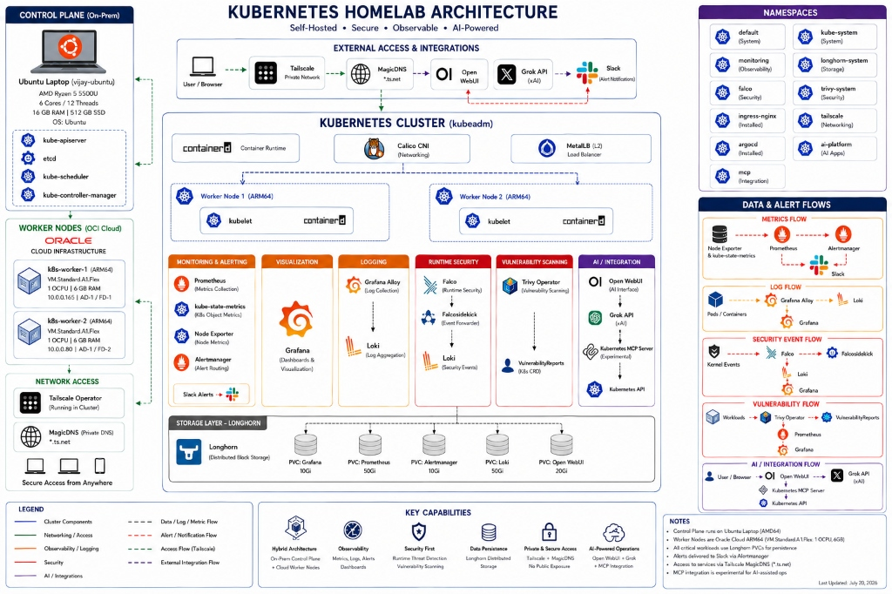
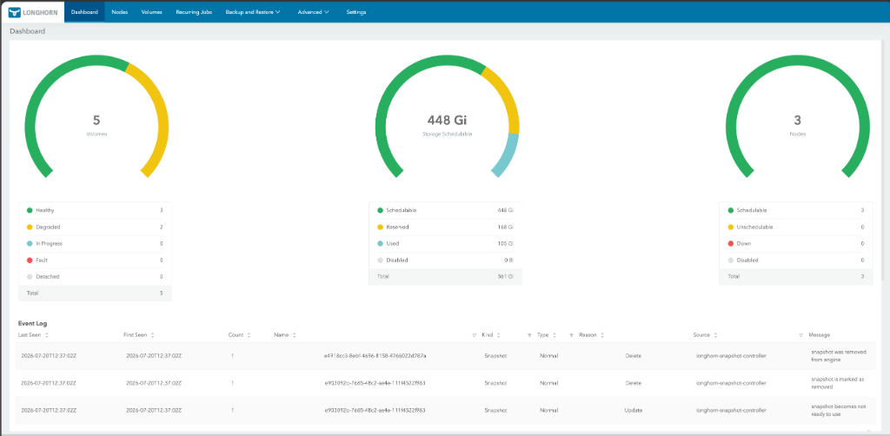
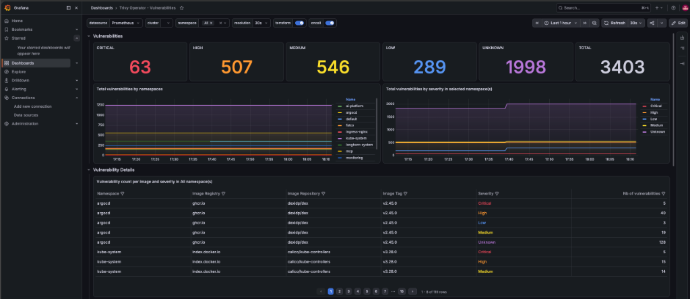

# Kubernetes Self-Hosted Home Lab

A self-hosted Kubernetes platform running across an on-prem Ubuntu laptop and Oracle Cloud ARM instances. Built to learn production-grade platform engineering — observability, security, persistent storage, and more.



---

## Why I Built This

I wanted a place to experiment with Kubernetes beyond tutorials and sample applications. Instead of just deploying workloads, I focused on building the platform around them — monitoring, logging, security, and operational visibility.

---

## Infrastructure

This is a hybrid cluster. The control plane runs on a physical laptop. The worker nodes run on Oracle Cloud's free-tier ARM instances.

### Control Plane (On-Prem)

| Component | Details |
|-----------|---------|
| Host | Ubuntu Laptop (`vijay-ubuntu`) |
| CPU | AMD Ryzen 5 5500U — 6 cores / 12 threads |
| Memory | 16 GB DDR4 |
| Storage | 512 GB NVMe SSD |
| OS | Ubuntu (LVM, 466 GB root partition) |
| Role | control-plane |
| Kubernetes | v1.31.14 (kubeadm) |

### Worker Nodes (Oracle Cloud)

Both workers are ARM-based instances on Oracle Cloud Infrastructure (OCI), Hyderabad region.

| Node | Instance Type | Architecture | OCPU | Memory | Public IP | Private IP |
|------|---------------|-------------|------|--------|-----------|------------|
| k8s-worker-1 | VM.Standard.A1.Flex | ARM64 (aarch64) | 1 | 6 GB | 144.24.158.28 | 10.0.0.165 |
| k8s-worker-2 | VM.Standard.A1.Flex | ARM64 (aarch64) | 1 | 6 GB | 140.245.197.33 | 10.0.0.80 |

> Both workers run Kubernetes v1.30.14. The slight version skew with the control plane (v1.31.14) is within the supported skew policy.

### Cluster Summary

```
3 Nodes Total
├── 1 Control Plane  (AMD64, on-prem, Ubuntu laptop)
└── 2 Workers        (ARM64, Oracle Cloud Infrastructure)
    ├── k8s-worker-1 (AD-1 / FD-1)
    └── k8s-worker-2 (AD-1 / FD-2)

Total Resources
├── CPU:     14 cores (12 on-prem + 2 cloud)
├── Memory:  28 GB (16 on-prem + 12 cloud)
└── Storage: 512 GB NVMe (control plane) + cloud block storage
```

---

## Technology Stack

| Category | Technology | Purpose |
|----------|-----------|---------|
| **Orchestration** | Kubernetes (kubeadm) | Cluster management |
| **Container Runtime** | containerd | Container execution |
| **Networking (CNI)** | Calico | Pod networking, network policy |
| **Ingress** | NGINX Ingress Controller | HTTP/HTTPS routing |
| **Load Balancer** | MetalLB (L2) | Bare-metal load balancer |
| **Storage** | Longhorn | Distributed block storage |
| **Monitoring** | Prometheus + kube-state-metrics + node-exporter | Metrics collection |
| **Visualization** | Grafana | Dashboards and visualization |
| **Alerting** | Alertmanager → Slack | Alert routing and notifications |
| **Log Collection** | Grafana Alloy | Log collection agent (DaemonSet) |
| **Log Aggregation** | Loki | Log storage and querying |
| **Runtime Security** | Falco + Falcosidekick | Kernel-level threat detection |
| **Vulnerability Scanning** | Trivy Operator | Image and workload scanning |
| **GitOps** | ArgoCD | Continuous delivery (installed) |
| **Remote Access** | Tailscale Operator + MagicDNS | Private mesh networking |
| **AI Interface** | Open WebUI | LLM frontend |
| **AI Backend** | Grok API (xAI) | External LLM provider |
| **MCP Integration** | Kubernetes MCP Server | Experimental AI-cluster bridge |
| **Metrics Server** | metrics-server | Resource metrics for HPA/VPA |

---

## Architecture

### Networking

The cluster uses **Calico** for pod networking with **MetalLB** in L2 mode for service load balancing. **NGINX Ingress Controller** handles HTTP routing.

All services are exposed through **Tailscale** — no ports are opened to the public internet. The Tailscale Operator runs inside the cluster and creates dedicated proxies for each service:

```
Tailscale Proxies (running in-cluster)
├── ts-monitoring-grafana       → Grafana
├── ts-prometheus-ui            → Prometheus
├── ts-alertmanager-ui          → Alertmanager
├── ts-longhorn-frontend        → Longhorn UI
├── ts-argocd-server            → ArgoCD
├── ts-open-webui-ts            → Open WebUI
└── Accessible via MagicDNS     → *.ts.net
```

> Services are reachable from any device on the tailnet using MagicDNS hostnames. No public exposure.

<!-- TODO: Add screenshots/tailscale-admin.png -->

### Storage

**Longhorn** provides distributed block storage across all three nodes. Each stateful workload gets a dedicated PersistentVolumeClaim:

| PVC | Size | Workload |
|-----|------|----------|
| PVC: Grafana | 10Gi | Grafana dashboards and config |
| PVC: Prometheus | 50Gi | Metrics retention |
| PVC: Alertmanager | 10Gi | Alert state |
| PVC: Loki | 50Gi | Log storage |
| PVC: Open WebUI | 20Gi | AI chat history and config |



---

## Monitoring and Alerting

The monitoring stack is built on the **kube-prometheus-stack** Helm chart:

- **Prometheus** scrapes metrics from node-exporter, kube-state-metrics, and all instrumented workloads
- **Grafana** serves as the single visualization layer for metrics, logs, and security data
- **Alertmanager** routes alerts to **Slack** based on severity and namespace

```
Metrics Flow
─────────────
Node Exporter ─┐
                ├──→ Prometheus ──→ Alertmanager ──→ Slack
kube-state-     │         │
metrics    ─────┘         └──→ Grafana
```

### Alerting Validation

To verify the alerting pipeline end-to-end, I intentionally scaled a deployment's replicas to zero. This triggered `KubeDeploymentReplicasMismatch` in Prometheus, which Alertmanager picked up and forwarded to Slack.

<!-- TODO: Add screenshots for Grafana dashboards, Prometheus, Alertmanager, and Slack alerts -->

---

## Logging

Logs are collected using the **Grafana Alloy → Loki → Grafana** pipeline:

- **Alloy** runs as a DaemonSet on every node, collecting container logs
- **Loki** aggregates and indexes logs for querying
- **Grafana** provides the LogQL query interface

```
Log Flow
────────
Pods / Containers ──→ Grafana Alloy ──→ Loki ──→ Grafana
                      (DaemonSet)       (StatefulSet)
```

Falcosidekick also forwards security events to Loki, creating a unified view of both application logs and security events in Grafana.

<!-- TODO: Add screenshots/grafana-loki-logs.png -->

---

## Security

### Runtime Threat Detection — Falco

**Falco** runs as a DaemonSet, monitoring kernel syscalls in real time. **Falcosidekick** forwards alerts to multiple destinations:

```
Security Event Flow
───────────────────
Kernel Events ──→ Falco ──→ Falcosidekick ──┬──→ Loki ──→ Grafana
                  (DaemonSet)               └──→ (extensible)
```

### Vulnerability Scanning — Trivy

The **Trivy Operator** continuously scans workloads and images, producing `VulnerabilityReport` CRDs that are scraped by Prometheus and visualized in Grafana.



```
Vulnerability Flow
──────────────────
Workloads ──→ Trivy Operator ──→ VulnerabilityReports (CRD)
                                     │
                                     ├──→ Prometheus ──→ Grafana
                                     └──→ kube-state-metrics
```

---

## Namespaces

The cluster is organized into purpose-specific namespaces:

| Namespace | Purpose |
|-----------|---------|
| `kube-system` | Core Kubernetes components, Calico, CoreDNS, etcd |
| `monitoring` | Prometheus, Grafana, Alertmanager, Loki, Alloy, node-exporter |
| `longhorn-system` | Longhorn distributed storage |
| `falco` | Falco runtime security + Falcosidekick |
| `trivy-system` | Trivy Operator vulnerability scanning |
| `ingress-nginx` | NGINX Ingress Controller |
| `argocd` | ArgoCD GitOps platform |
| `tailscale` | Tailscale Operator and service proxies |
| `ai-platform` | Open WebUI + Redis |
| `mcp` | Kubernetes MCP Server |
| `default` | Test workloads |

---

## Cluster State

### Nodes

```
$ kubectl get nodes
NAME           STATUS   ROLES           AGE     VERSION
k8s-worker-1   Ready    <none>          6d21h   v1.30.14
k8s-worker-2   Ready    <none>          6d21h   v1.30.14
vijay-ubuntu   Ready    control-plane   6d21h   v1.31.14
```

### All Pods (Running on Worker Nodes)

```
$ kubectl get pods -A
NAMESPACE         NAME                                                     READY   STATUS        RESTARTS       AGE
ai-platform       open-webui-0                                             1/1     Running       0              86m
ai-platform       open-webui-redis-695dcb9d5f-9wj9k                        1/1     Running       1 (88m ago)    2d8h
argocd            argocd-application-controller-0                          1/1     Running       1 (88m ago)    2d21h
argocd            argocd-applicationset-controller-8998bf8d-92lq4          1/1     Running       1 (88m ago)    2d21h
argocd            argocd-dex-server-755d44cc-8hhzt                         1/1     Running       1 (88m ago)    2d21h
argocd            argocd-notifications-controller-c668fd67c-hrmhn          1/1     Running       1 (88m ago)    2d21h
argocd            argocd-redis-78d7dccb7f-wkz55                            1/1     Running       1 (88m ago)    2d21h
argocd            argocd-repo-server-585ccc7645-ppgfk                      1/1     Running       1 (88m ago)    2d21h
argocd            argocd-server-57455cb49d-8zk72                           1/1     Running       1 (88m ago)    2d21h
default           nginx-app-d644564f4-2bwbk                                1/1     Running       1 (88m ago)    143m
default           nginx-app-d644564f4-8mdrn                                1/1     Running       1 (88m ago)    143m
default           nginx-app-d644564f4-8tt9t                                1/1     Running       1 (88m ago)    5h11m
default           nginx-app-d644564f4-jvtwg                                1/1     Running       1 (88m ago)    5h13m
falco             falco-d5q9g                                              2/2     Running       0              2d20h
falco             falco-falcosidekick-d4764b69b-nqrcq                      1/1     Running       1 (88m ago)    2d20h
falco             falco-falcosidekick-d4764b69b-rxffh                      1/1     Running       1 (88m ago)    2d6h
falco             falco-plxvm                                              0/2     Unknown       0              2d20h
falco             falco-wnsg4                                              2/2     Running       3 (20m ago)    2d20h
ingress-nginx     ingress-nginx-controller-547bc45676-w5wp4                1/1     Running       13 (88m ago)   3d
kube-system       calico-kube-controllers-68865dfcb6-48dqc                 1/1     Running       7 (88m ago)    8d
kube-system       calico-node-b7gks                                        1/1     Running       0              4d19h
kube-system       calico-node-rvrsm                                        1/1     Running       1 (48m ago)    4d19h
kube-system       calico-node-xrnbh                                        1/1     Running       1 (88m ago)    4d19h
kube-system       coredns-7c65d6cfc9-fn7vc                                 1/1     Running       2 (88m ago)    8d
kube-system       coredns-7c65d6cfc9-mmxcx                                 1/1     Running       2 (88m ago)    8d
kube-system       etcd-vijay-ubuntu                                        1/1     Running       1 (88m ago)    2d7h
kube-system       kube-apiserver-vijay-ubuntu                              1/1     Running       6 (88m ago)    8d
kube-system       kube-controller-manager-vijay-ubuntu                     1/1     Running       35 (86m ago)   2d7h
kube-system       kube-proxy-2lwkl                                         1/1     Running       1 (48m ago)    8d
kube-system       kube-proxy-ld2rj                                         1/1     Running       0              8d
kube-system       kube-proxy-w2vjb                                         1/1     Running       2 (88m ago)    8d
kube-system       kube-scheduler-vijay-ubuntu                              1/1     Running       39 (13m ago)   2d7h
kube-system       metrics-server-7584b7988b-z2tvs                          1/1     Running       1 (88m ago)    2d20h
longhorn-system   csi-attacher-dcf5f4778-7wmnq                             1/1     Running       8 (86m ago)    3d
longhorn-system   csi-attacher-dcf5f4778-jh7z2                             1/1     Running       6 (88m ago)    2d6h
longhorn-system   csi-attacher-dcf5f4778-l22q4                             1/1     Running       15 (81m ago)   42h
longhorn-system   csi-provisioner-85886d6599-flzbl                         1/1     Running       15 (81m ago)   3d
longhorn-system   csi-provisioner-85886d6599-pcbqs                         1/1     Running       6 (88m ago)    42h
longhorn-system   csi-provisioner-85886d6599-wkms4                         1/1     Running       8 (86m ago)    2d6h
longhorn-system   csi-resizer-64fd6c6db9-8m5jp                             1/1     Running       8 (81m ago)    2d6h
longhorn-system   csi-resizer-64fd6c6db9-hx2m8                             1/1     Running       17 (88m ago)   3d
longhorn-system   csi-resizer-64fd6c6db9-xhxvq                             1/1     Running       4 (88m ago)    42h
longhorn-system   csi-snapshotter-69b79bc644-cr8qp                         1/1     Running       13 (88m ago)   2d6h
longhorn-system   csi-snapshotter-69b79bc644-x9rn4                         1/1     Running       6 (86m ago)    42h
longhorn-system   csi-snapshotter-69b79bc644-xcf8j                         1/1     Running       7 (81m ago)    3d
longhorn-system   engine-image-ei-a4d05f02-5rs2f                           1/1     Running       5 (48m ago)    3d
longhorn-system   engine-image-ei-a4d05f02-m67p4                           1/1     Running       1 (8h ago)     3d
longhorn-system   engine-image-ei-a4d05f02-xmnz9                           1/1     Running       1 (88m ago)    3d
longhorn-system   instance-manager-fb684a3edd7d8b12fce28628a8c35b26        1/1     Running       0              87m
longhorn-system   instance-manager-fd54f58cd08d40ea72b785096cff0498        1/1     Running       0              88m
longhorn-system   longhorn-csi-plugin-4rch7                                0/3     Unknown       0              3d
longhorn-system   longhorn-csi-plugin-kxqrp                                3/3     Running       0              3d
longhorn-system   longhorn-csi-plugin-njzzm                                3/3     Running       3 (88m ago)    3d
longhorn-system   longhorn-driver-deployer-7b5884966f-jf85v                1/1     Running       3 (88m ago)    3d
longhorn-system   longhorn-manager-b88pb                                   2/2     Running       3 (88m ago)    3d
longhorn-system   longhorn-manager-nt886                                   2/2     Running       2 (48m ago)    3d
longhorn-system   longhorn-manager-rv7gj                                   2/2     Running       1              3d
longhorn-system   longhorn-ui-56fcbf68c9-685mg                             1/1     Running       1 (88m ago)    42h
longhorn-system   longhorn-ui-56fcbf68c9-fg42v                             1/1     Running       1 (88m ago)    3d
mcp               kubernetes-mcp-server-757576df77-npnzs                   1/1     Running       1 (88m ago)    2d6h
monitoring        alertmanager-monitoring-kube-prometheus-alertmanager-0   2/2     Running       0              85m
monitoring        alloy-2dk9x                                              2/2     Running       0              2d21h
monitoring        alloy-2llk7                                              2/2     Running       2 (88m ago)    2d21h
monitoring        alloy-rwrl8                                              0/2     Unknown       0              2d21h
monitoring        loki-canary-6s7h2                                        0/1     Unknown       0              2d23h
monitoring        loki-canary-bb9rq                                        1/1     Running       1 (88m ago)    2d23h
monitoring        loki-canary-v4shk                                        1/1     Running       0              2d23h
monitoring        monitoring-grafana-58db4f847b-22xs9                      3/3     Running       0              78m
monitoring        monitoring-kube-prometheus-operator-d65f78645-q6p58      1/1     Running       1 (88m ago)    2d19h
monitoring        monitoring-kube-state-metrics-7656547675-shvkx           1/1     Running       24 (74m ago)   8d
monitoring        monitoring-prometheus-node-exporter-2zt7z                1/1     Running       1 (48m ago)    2d19h
monitoring        monitoring-prometheus-node-exporter-8jqh9                1/1     Running       31 (88m ago)   2d19h
monitoring        monitoring-prometheus-node-exporter-k8lc8                1/1     Running       0              2d19h
monitoring        prometheus-monitoring-kube-prometheus-prometheus-0       2/2     Running       0              86m
tailscale         operator-5f8bdd949f-nxcc8                                1/1     Running       1 (88m ago)    2d17h
tailscale         ts-alertmanager-ui-k6scm-0                               1/1     Running       1 (88m ago)    2d8h
tailscale         ts-argocd-server-wfgxp-0                                 1/1     Running       1 (88m ago)    2d17h
tailscale         ts-longhorn-frontend-2lsm8-0                            1/1     Running       1 (88m ago)    2d17h
tailscale         ts-monitoring-grafana-7lwxg-0                            1/1     Running       1 (88m ago)    2d17h
tailscale         ts-open-webui-ts-b6jtj-0                                 1/1     Running       1 (88m ago)    2d8h
tailscale         ts-prometheus-ui-6t5jm-0                                 1/1     Running       1 (88m ago)    2d8h
trivy-system      trivy-operator-64d66c4f5d-9gz9j                          1/1     Running       1 (88m ago)    2d21h
```

---

## Data Flows

A summary of how data moves through the platform:

```
┌────────────────────────────────────────────────────────────────┐
│ METRICS      Node Exporter → Prometheus → Alertmanager → Slack │
│              kube-state-metrics ↗    ↘ Grafana                 │
├────────────────────────────────────────────────────────────────┤
│ LOGS         Pods → Grafana Alloy → Loki → Grafana             │
├────────────────────────────────────────────────────────────────┤
│ SECURITY     Kernel → Falco → Falcosidekick → Loki → Grafana   │
├────────────────────────────────────────────────────────────────┤
│ VULNS        Workloads → Trivy → CRDs → Prometheus → Grafana   │
└────────────────────────────────────────────────────────────────┘
```

---

## Interesting Challenges

Things that weren't straightforward and required debugging:

- **Hybrid ARM64/AMD64 cluster** — Had to ensure all container images support multi-arch. Some Helm charts pulled amd64-only images by default, requiring overrides.
- **Longhorn on mixed architectures** — Getting distributed storage to replicate correctly across ARM and AMD nodes took configuration tuning.
- **Grafana persistent storage migration** — Moving Grafana from ephemeral to persistent storage without losing dashboards required careful PVC provisioning and data migration.
- **Tailscale service exposure** — Configuring the Tailscale Operator to create per-service proxies instead of exposing the entire node required understanding the Tailscale Kubernetes integration deeply.
- **Falcosidekick → Loki integration** — Routing Falco security events into the same Loki instance used for application logs, making security events queryable alongside container logs in Grafana.
- **RBAC for Kubernetes MCP Server** — The MCP server needed carefully scoped RBAC to allow AI-assisted cluster queries without granting excessive permissions.
- **Prometheus storage sizing** — 50Gi PVC for Prometheus with appropriate retention policies to balance storage consumption against metric history on resource-constrained nodes.

---

## Lessons Learned

- Start with monitoring and logging early. They make debugging everything else much faster.
- Tailscale for remote access eliminates the need to open any ports. No port forwarding, no dynamic DNS, no firewall rules.
- Longhorn makes persistent storage on bare metal practical, but it needs at least 3 replicas for reliability.
- Falco is noisy at first. Tuning rules to your specific workloads takes time but is worth it.
- Running the control plane on a laptop means dealing with sleep, reboots, and network changes. The cluster recovers, but etcd takes a moment.
- ARM workers on Oracle Cloud's free tier are surprisingly capable for homelab workloads.

---

## Future Roadmap

- [ ] GitOps with ArgoCD — manage all workloads declaratively from this repository
- [ ] OpenTelemetry — distributed tracing alongside metrics and logs
- [ ] Expand MCP integration — more AI-assisted operational capabilities

---
---

## License

MIT

---

*Last updated: July 22, 2026*
